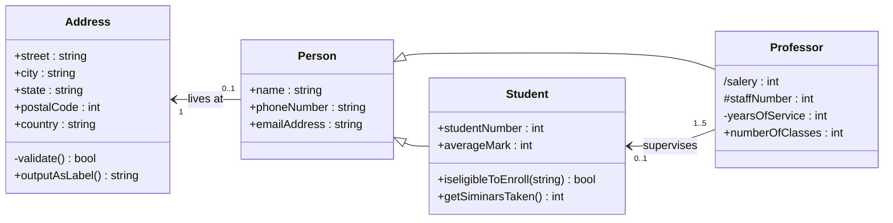

```mermaid
classDiagram
  direction RL
  class Person {
    +name : string
    +phoneNumber : string
    +emailAddress : string
  }
  class Student{
    +studentNumber : int
    +averageMark : int
    +iseligibleToEnroll(string) bool
    +getSiminarsTaken() int
  }
  class Professor{
    /salery : int
    #staffNumber : int
    -yearsOfService : int
    +numberOfClasses : int
  }
  class Address{
    +street : string
    +city : string
    +state : string
    +postalCode : int
    +country : string
    -validate() bool
    +outputAsLabel() string
  }
  Person "0..1" --> "1" Address : lives at
  Professor --|> Person
  Student --|> Person
  Professor "1..5" --> "0..1" Student : supervises

```
