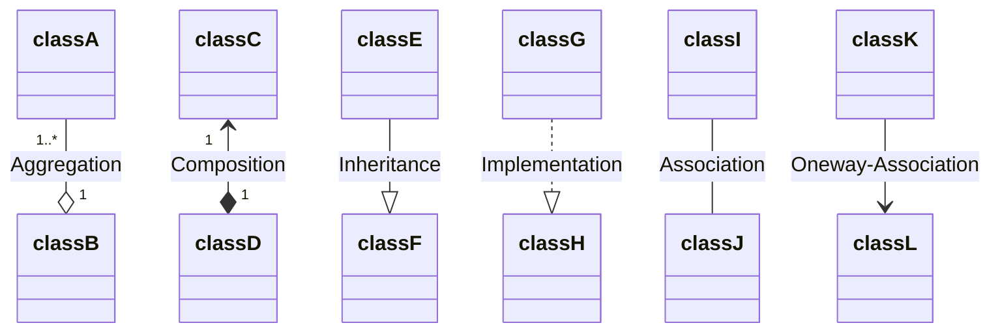

```mermaid
classDiagram
classA "1..*" --o "1" classB : Aggregation
classC "1" <--* "1" classD : Composition
classE --|> classF : Inheritance
classG ..|> classH : Implementation
classI -- classJ : Association
classK --> classL : Oneway-Association
```
