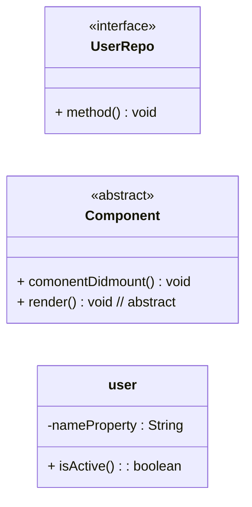

```mermaid
classDiagram
  direction RL
  class UserRepo{
    <<interface>>
    + method() void
    }
  class Component{
    <<abstract>>
    + comonentDidmount() void
    + render() void // abstract
  }
  class user{
    -nameProperty : String
    + isActive() : boolean
  }
```
